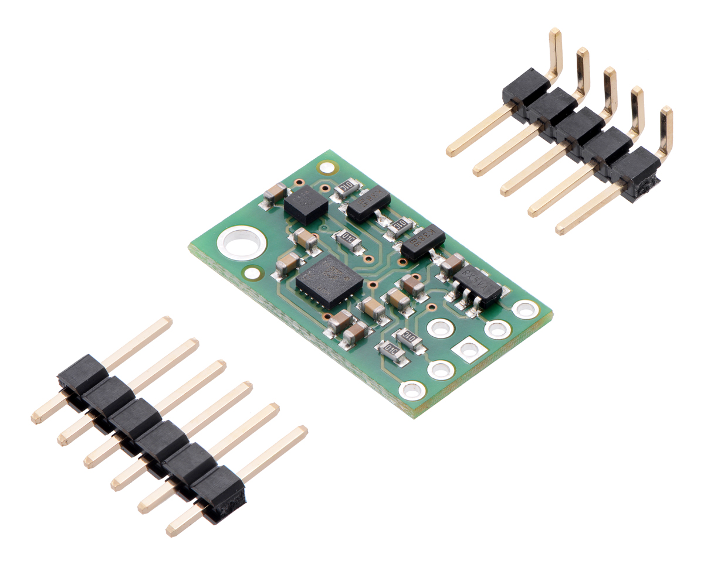
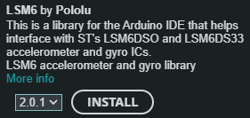

# MiniMU-9 V5 documentation



# Specifications

- Dimensions: 20 mm × 13 mm × 3 mm
- Weight without header pins: 0.7 g (0.02 oz)
- Operating voltage: 2.5 V to 5.5 V
- Supply current: 5 mA
- Output format (I²C):
    - Gyro: one 16-bit reading per axis
    - Accelerometer: one 16-bit reading per axis
    - Magnetometer: one 16-bit reading per axis
- Sensitivity range:
    - Gyro: ±125, ±245, ±500, ±1000, or ±2000°/s
    - Accelerometer: ±2, ±4, ±8, or ±16 g
    - Magnetometer: ±4, ±8, ±12, or ±16 gauss

# Quick start

## installing "lsm6-arduino"-library
If you are using version 1.6.2 or later of the [Arduino software (IDE)](http://www.arduino.cc/en/Main/Software), you can use the Library Manager to install this library:

1. In the Arduino IDE, open the "Sketch" menu, select "Include Library", then "Manage Libraries...".
2. Search for "LSM6".



3. Click the LSM6 entry in the list.
4. Click "Install".

If this does not work, you can manually install the library:

1. Download the [latest release archive from GitHub](https://github.com/pololu/lsm6-arduino/releases) and decompress it.
2. Rename the folder "lsm6-arduino-master" to "LSM6".
3. Move the "LSM6" folder into the "libraries" directory inside your Arduino sketchbook directory.  You can view your sketchbook location by opening the "File" menu and selecting "Preferences" in the Arduino IDE.  If there is not already a "libraries" folder in that location, you should make the folder yourself.
4. After installing the library, restart the Arduino IDE.

# Example
```C
    // the setup function runs once when you press reset or power the board
    void setup() {

    }

    // the loop function runs over and over again forever
    void loop() {

    }
```